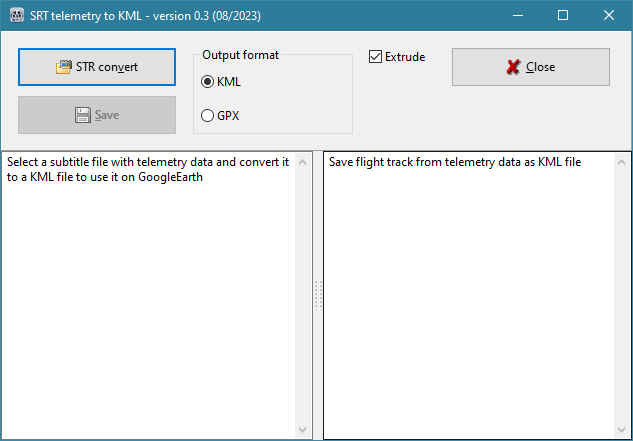

# SRTtoKML
Select a subtitle file with telemetry data from DJI drone and convert it to a KML or GPX file to use it on GoogleEarth.

DJI Mini 3 creates a subtitle file (*.SRT) for each video. This file contains telemetry data with coordinates and altitude.
This application converts this telemetry data to a KML or GPX file which can be used to show the flight track of this video in GoogleEarth or other map service.

How to use:
Click on "STR convert" and select a *.SRT file. The file will be converted to a KML or GPX flight track. The original file is in the left text field, the result in the right.
There is a slider between the texts where you can adjust width of it.
Then click on "Save" to save the output file. File name will be proposed in the same folder as the source file and with the same name. You can change it anyway.

Help: 
Hold the mouse pointer over the controls to get more information.
